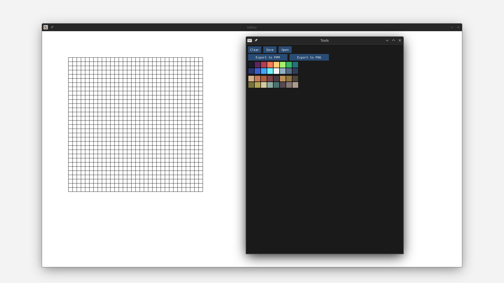

# Pixie

Pixie is a pixel art editor written in C++ and SDL2 still in early stages of development

### Requirements
- Any c++ compiler thats supports c++20
- cmake >= 3.18

### TODO
- [Planned Features](planned_features.md)
- [Planned Bug fixes](planned_bugfixes.md)

### Screenshots



### Documentation
#### Controls
  - LMB - Fill in a cell
  - RMB - Clear a cell
#### Color Palettes
The name of the file containing the color palette should be `filename.palette`. The first line should contain the width and height separated by space. The following lines should contain the RGBA hex codes of the colors
##### example
```
2 2
#ff0000ff
#00ff00ff
#0000ffff
#ff00ffff
```
and then click on "Add color palette" and choose the file. A few palettes are already provided in `palettes/`

### Building
Currently, only Linux (X11) is supported

Build and run:
```bash
git clone https://github.com/wwsmiff/pixel_art_editor
cd pixel_art_editor
cmake -S . -B build # To initialize cmake
cmake --build build -- -j$(nproc) # To build the project
./build/Pixie # To run it
```

### Contributing
 - [contributing.md](contributing.md)

### Libraries used
 - [SDL2](http://libsdl.org/)
 - [gvdi](https://github.com/karnkaul/gvdi/)
 - [stb_image_writer.h](https://github.com/nothings/stb/blob/master/stb_image_write.h)
 - [portable-file-dialogs](https://github.com/samhocevar/portable-file-dialogs)
