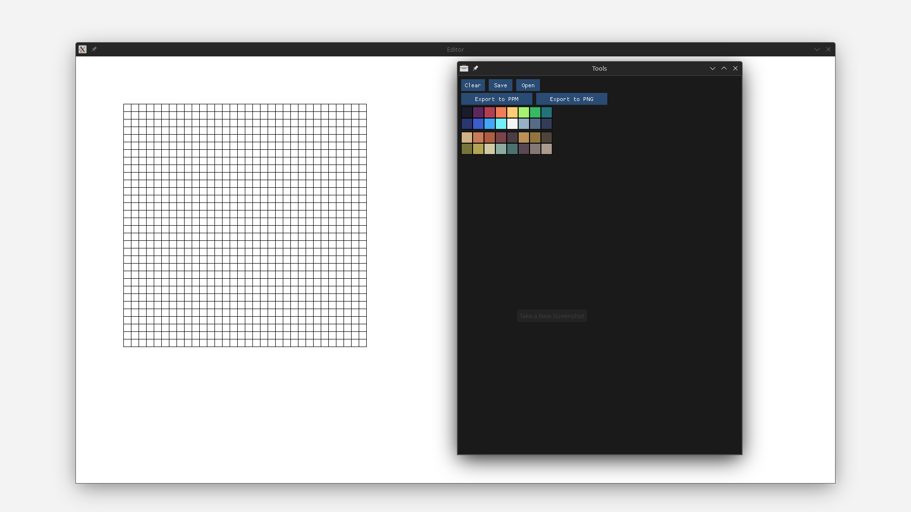
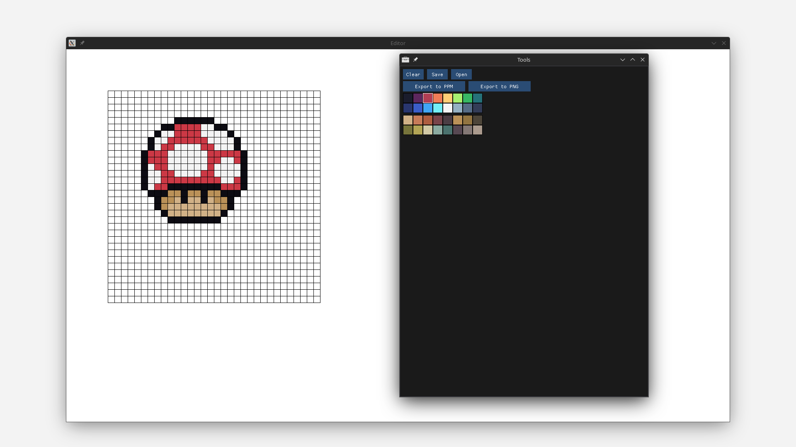
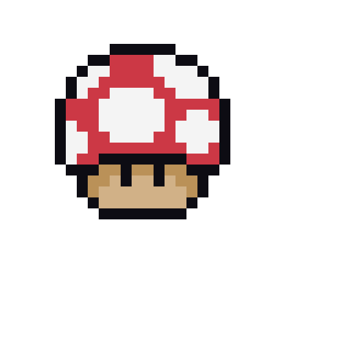

# Pixie

Pixie is a pixel art editor written in C++ and SDL2 still in early stages of development

### Requirements
- Any c++ compiler thats supports c++20
- cmake >= 3.18

### TODO
- [Planned Features](planned_features.md)
- [Planned Bug fixes](planned_bugfixes.md)

### Screenshots




### Building
Currently, only Linux is supported

Install dependencies:
- Debian Linux and its derivatives
```bash
sudo apt install libsdl2-2.0-0 libsdl2-dev libsdl2-ttf-2.0-0 libsdl2-ttf-dev
```
- Arch Linux and its derivatives
```bash
sudo pacman -S sdl2 sdl2_ttf
```
- Fedora Linux
```bash
sudo dnf install SDL2 SDL2-devel SDL2_ttf SDL2_ttf-devel
```
- Solus
```bash
sudo eopkg it sdl2 sdl2-ttf
```

Build and run:
```bash
git clone https://github.com/wwsmiff/pixel_art_editor
cd pixel_art_editor
cmake -S . -B build # To build the project
./build/Pixie # To run the project
```

### Contributing
 - [contributing.md](contributing.md)

### Libraries used
 - [SDL2](http://libsdl.org/)
 - [SDL2_ttf](https://wiki.libsdl.org/SDL2_ttf/FrontPage)
 - [stb_image_writer.h](https://github.com/nothings/stb/blob/master/stb_image_write.h)
